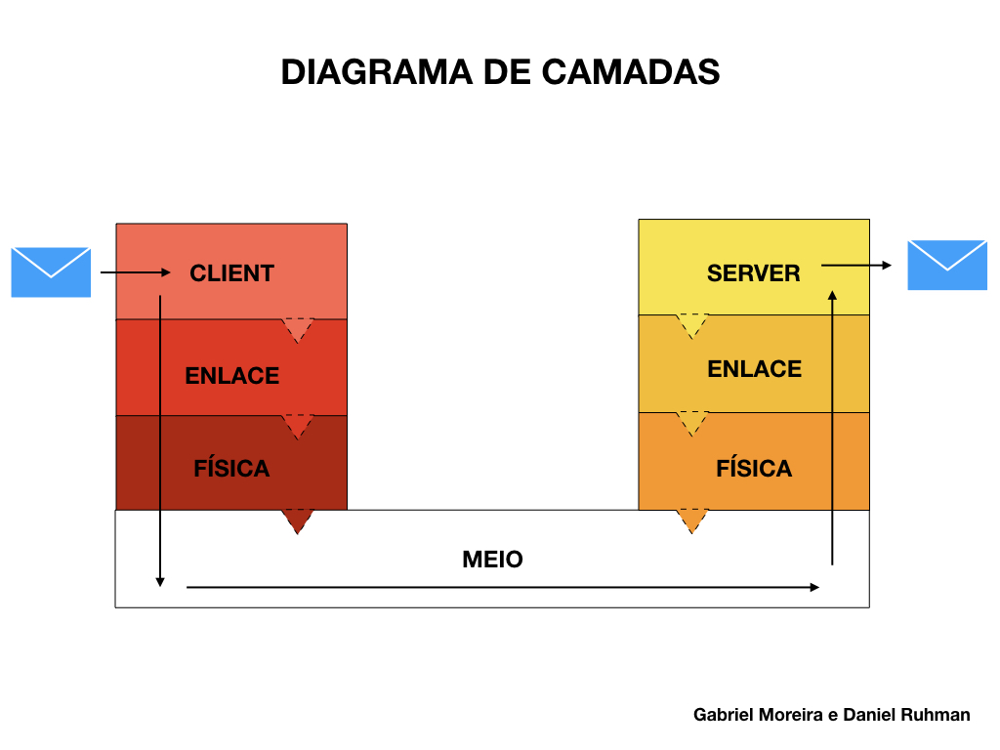
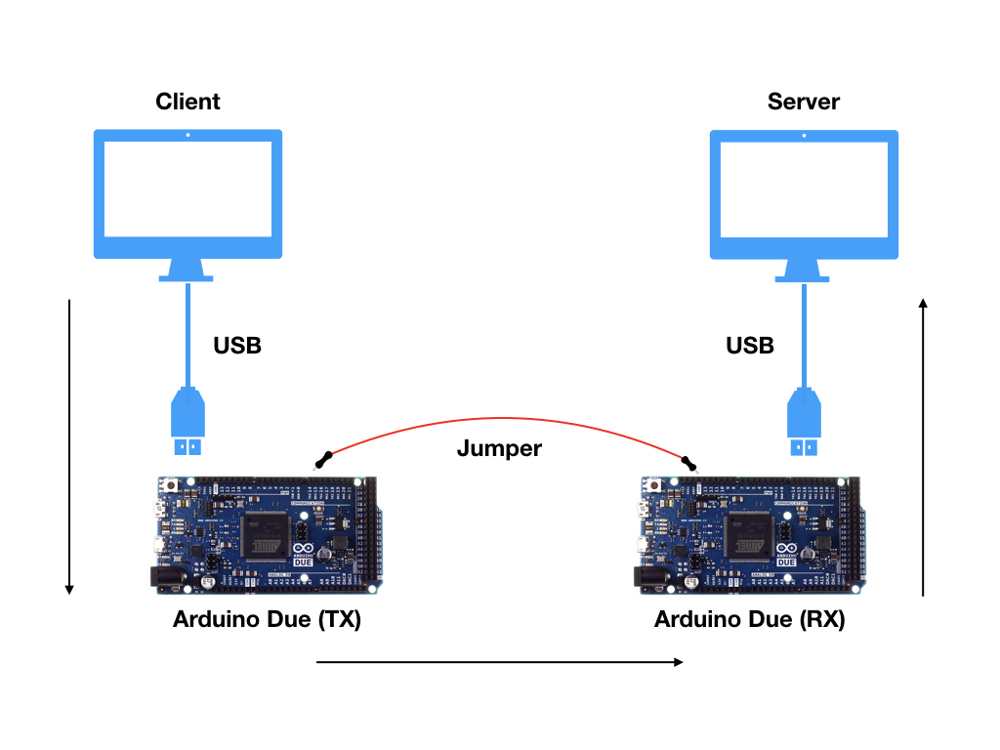
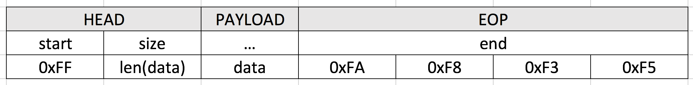
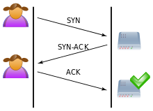

# Camada Física - Projeto 1 - COM-Client-Server
Gabriel Moreira e Daniel Ruhman

## Diagrama de camadas

 

## Diagrama de funcionamento

 

## Datagrama Proj 2

 

## Documentação projeto 3:

Nesse projeto, foi implementado um protocolo de handshake na camada de enlace.
Esse protocolo garante ao Client que seus dados só serão enviados quando o Server estiver
pronto para recebe-los.
Além disso, foi implementado também um protocolo de reconhecimento via ACK e nACK de maneira que o client sempre
 sabe o status dos dados e, caso necessario, pode reenviar o pacote.

 Para formar a conexão com o Server, o Client envia um pacote SYN para o Server, que deve responder se ele recebeu esse SYN. Se receber, ele envia um pacote comando ACK, reconhecendo que recebeu o SYN e em seguida envia um SYN para confirmar a conexão. O Client recebe esses pacotes ACK + SYN, e  então responde ACK para confirmar a conexão também. Com a conexão estabelecida, o Client pode começas a enviar os dados normalmente. Se em algum momento um nAck for enviado por alguma das partes, o handshake reinicia. A figura a seguir ilustra esse Handshake, de maneira que a "menina" é o Client e o HD, o Server (a conexão é estabelecida quando ele fica com o check verde):

### Máquinas de Estado

As máquinas de estado avaliam o estado da comunicação entre  o Client e o Server e agem de acordo. Os estados são setados conforme o tempo e os dados recebidos nos pacotes.

## Documentação projeto 4:

Para esse projeto, implementamos a fragmentação de pacotes na camada de enlace. Isso deixa o envio de dados mais eficiente, além de facilitar a detecção de erros.
Para detectar erros, foi implemntado um algoritmo CRC (Cyclic Redundancy Check) para o Head e outro para o payload. O Server então analisa o CRC e envia um ACK/NACK caso o pacote tenha sido recebido com sucesso ou não, respectivamente.

### Fragmentação

Inicialmente, dividimos o payload em pacotes de 2048 bytes. Os pacotes são enviados sequencialmente, e, idealmente, ter uma resposta respectiva: ACK ou NACK.
Em caso de NACK, ou de falta de resposta por um período de tempo (timeout), o(s) pacote(s) deve ser reenviado.

### CRC

Cyclic Redundancy Check (CRC) é um algoritmo de detecção de erros. Ele se baseia na divisão de polinômios. Para isso, ele analisa os dados como coeficientes de um polinômio e realiza uma divisão binária, aplicando um XOR a cada termo. 
Nesta divisão o dividendo é igual aos dados, o divisor é o polinômio escolhido como "key" e o resto da divisão é o CRC. Quanto maior o grau do polinomio escolhido como "key", mais precisa será a conta e, portanto, a detecção de erros. Verificamos então:

* Se o CRC do head calculado confere com o CRC enviado no HEAD
* Se o CRC do payload calculado confere com o CRC enviado para o payload

O polinômio "key" usado é o x^8+x^2+x^1+1, que se traduz em binário para 0x107, o CRC-8. Ele é simples e eficiente, de maneira que gera um CRC de 8 bits - suficiente para o projeto, e contribuindo para um baixo Overhead.

Idealmente, o CRC deve ser calculado individualmente para o Head e para o payload, de maneira que seja possível detectar anomalias em cada um desses dados, e corrigi-las.